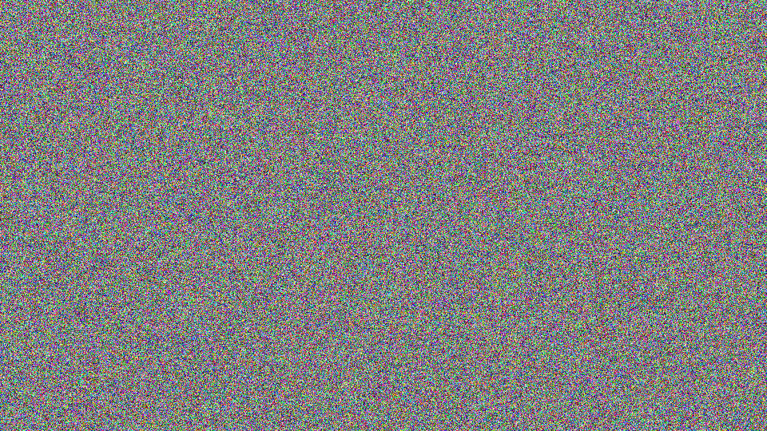
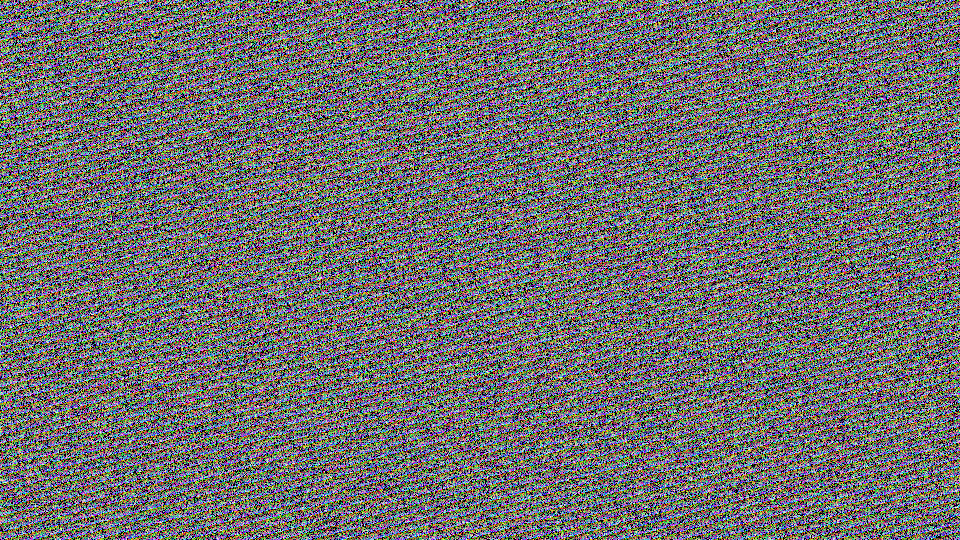
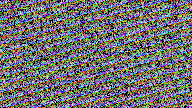
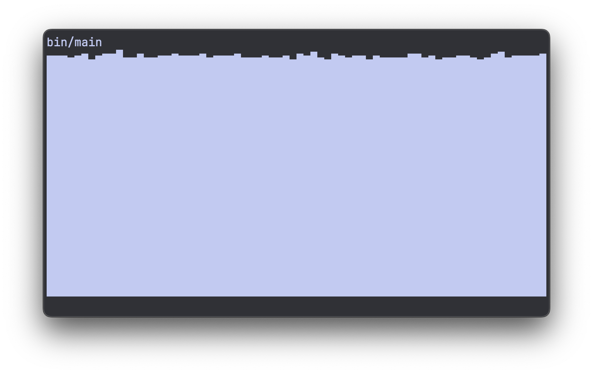
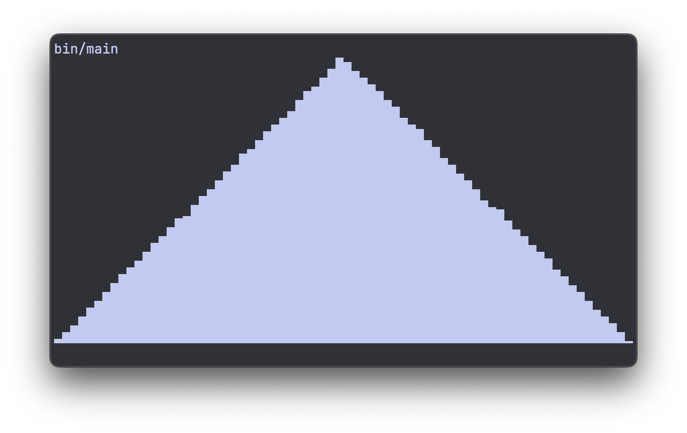
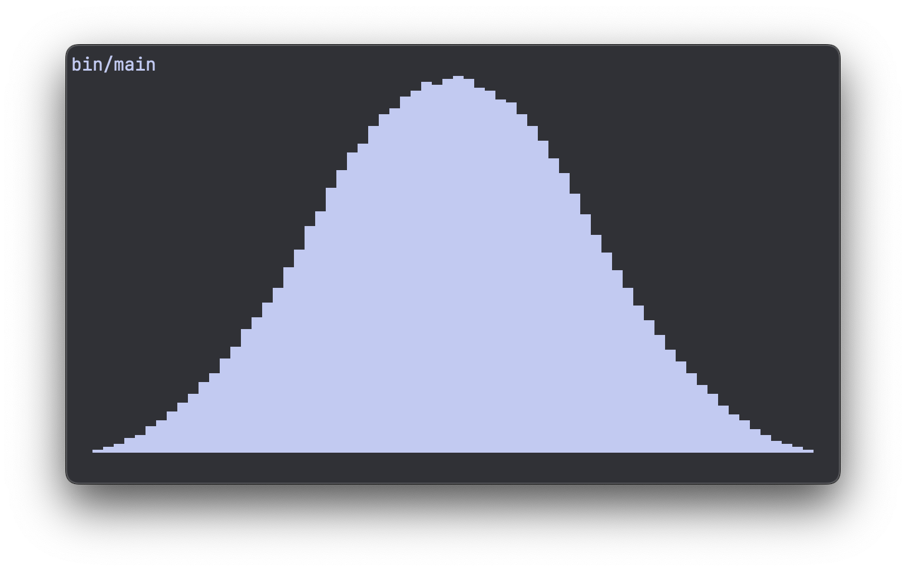
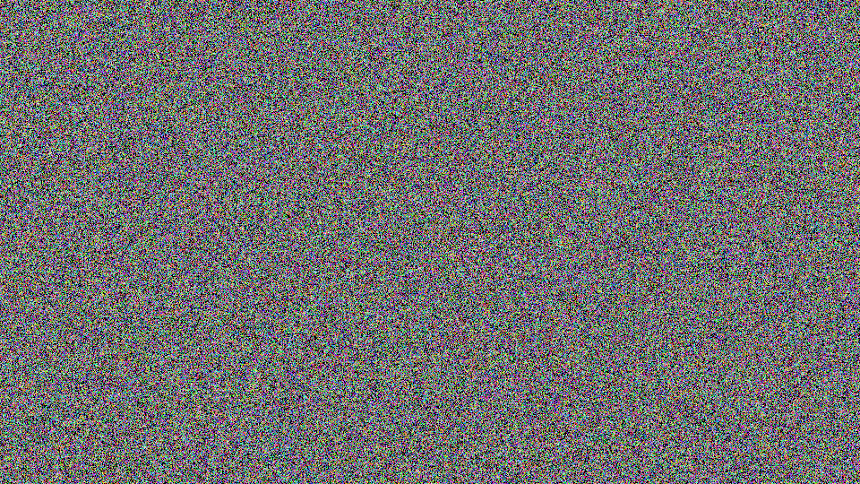
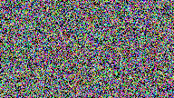

---
date:
  created: 2026-09-14
  updated: 2026-09-14
authors:
  - richard
slug: stop-using-rand
categories:
  - Tutorials
tags:
  - C
  - From scratch
draft: true
---

# Stop using `rand()`

In this article I will try to convince you to stop using `rand()` in your C projects,
and write a better alternative from scratch.

Before I entered the RNG rabbit hole, I was definitely guilty of grabbing `rand()`, and
maybe some `srand(time(NULL))` when I needed it to be "unpredictable".

> *"But I'm not using it for cryptography"*

In the back of my mind I always knew that `rand()` was not a "safe" random number
generator, but when you just need some randomness for statistics or machine learning,
who cares?

After digging a bit deeper though, I found out stronger reasons for ditching
`rand()` and using something better.

<!-- more -->


## Why not?

The three main reasons I don't use `rand()` anymore:

1. It's platform dependent
2. It's slow
3. It's low quality

### Platform dependent

This means that `rand()` behaves differently depending on the platform you compile it
for. What might be different? The maximum random number you can get (`RAND_MAX`) might
be different, also the sequence of random numbers after a given seed set with `srand()`
can be different. So that can be pretty annoying.

### Slow

The `rand` function is not doing any complex math, but it relies on a *global state* and
needs to acquire a lock to be able to mutate it (at least my implementation on MacOS).
This happens every time you call `rand()`. So when you're calling it in a hot loop, it
can get pretty slow compared to rolling your own RNG.

### Low quality

The quality of random numbers that `rand()` produces is poor, we already knew that it's
not "cryptographically safe" to use. But if we look at some simple alternatives, we can
easily get way higher quality random numbers. (longer periods for example, so less
repetition in sequences)

## Putting `rand()` to the test

Humans are pretty good at recognizing visual patterns. So to test a random number
generator, you can use visualization to expose flaws. Let's do that with `rand()`.

If we create a 960 × 540 pixel buffer, and pick random color values for each pixel using
`rand()`:

```c
#define WIDTH 960
#define HEIGHT 540
#define DEPTH 3 // RGB

#define BUF_LEN (WIDTH * HEIGHT * DEPTH)

int main(void) {
  uint8_t pix_buffer[BUF_LEN] = {};

  for (size_t i = 0; i < WIDTH * HEIGHT; ++i) {
    uint8_t *pixel = &pix_buffer[i * DEPTH];

    uint32_t roll = rand();
    uint32_t pixel_col = roll / (RAND_MAX + 1.0) * (1 << 24);
    memcpy(pixel, &pixel_col, DEPTH);
  }

  // Writing the pixels to an image here
}
```
*(if you want to know how to write the pixels to an image, I cover it in the
[video](https://youtu.be/-5NqTA-fDNQ) and you can see the code in the
[repository](https://github.com/vanderoost/rng.c))*


We get an image that looks like this:

{ .pixelated }

Looks pretty random, no weird patterns or repetition.

But if we change the way we color in the pixels, we can push `rand()` to its limits.

Instead of looping over pixels, we'll take a certain amount of "samples". For every
sample, we pick a random number to decide which pixel to color, then we pick another
random number that decides the color for that pixel:

```c
#define SAMPLE_COUNT (1 << 20)

#define WIDTH 960
#define HEIGHT 540
#define DEPTH 3 // RGB

int main(void) {
  uint8_t pix_buffer[BUF_LEN] = {};

  for (size_t i = 0; i < SAMPLE_COUNT; ++i) {
    uint32_t roll_a = rand();
    uint32_t roll_b = rand();

    size_t pixel_ix = roll_a / (RAND_MAX + 1.0) * WIDTH * HEIGHT;
    uint8_t *pixel = &pix_buffer[pixel_ix * DEPTH];

    uint32_t pixel_col = roll_b / (RAND_MAX + 1.0) * (1 << 24);

    memcpy(pixel, &pixel_col, DEPTH);
  }

  // Writing the pixels to an image here
}
```

And this is the image you get:

{ .pixelated }

Looks okay at first glance, but if you zoom in you can clearly start to see some
repetition:

{ .pixelated }

The reason for this pattern is that we call `rand()` once for the position, and then
again for the color. And if you call `rand()` twice, the second call really depends on
the first call. So in this loop, the color depends on the location, that's what causes
the stripe pattern.

So, `rand()` is clearly suboptimal. How can we improve it?


## RNG from first principles

First, I'd like to get a basic understanding of how a pseudo random number generator
works.

There are a lot of different approaches for generating random numbers. Most of them
share the basic principle of having some kind of **state**, and being able to
**scramble** this state to make it appear "random".

The random number you get when you call the generator is based on this state, and every
time you generate a random number, the state gets mutated. So the next time you generate
a random number, you will get a different one.

With this in mind, the most basic example of a pseudo random number generator might be
something like this:

```c
static uint32_t rng_state = 1;

uint32_t rng_u(void) {
  return rng_state *= 12343;
}
```

It has a state `rng_state`, and it "scrambles" this state by multiplying it by some
constant `12343`. I just picked an arbitrary 5 digit prime number for this. My intuition
is that prime numbers avoid any obvious repetition.

The list of "random" numbers this thing generates looks like this:

```console
12343
152349649
3551009255
4260946081
982938263
3419336305
2519362119
923411777
```

Even this basic example looks pretty random at first glance. But of course, you can see
that the first number is exactly our factor `12343` and we multiply by this amount every
time, until we wrap around back to `0` at `4,294,967,296` (2³²).

This also means that we never generate an even number. So there are plenty of flaws to
this approach. But this is the basic principle: a state that gets scrambled. We just
need to "scramble" it a bit better.


## Larger state and better scrambling

What also helps, is to reserve more bytes for the state. It's generally a good idea to
have more bytes of state than the bytes of the random number you want to generate. So if
you want to generate 32-bit random numbers, having a state of 64 bits would be a good
idea.

Getting the optimal scrambling is a wheel I'd rather not re-invent myself. So I've
searched for robust existing methods that have proved to behave well, and are backed by
research and testing.

The best approach I've found in terms of simplicity, performance, and quality, is the
[PCG family](https://pcg-random.org). On that website, they share a basic C
implementation that looks like this:

```c
// *Really* minimal PCG32 code / (c) 2014 M.E. O'Neill / pcg-random.org
// Licensed under Apache License 2.0 (NO WARRANTY, etc. see website)

typedef struct { uint64_t state;  uint64_t inc; } pcg32_random_t;

uint32_t pcg32_random_r(pcg32_random_t* rng)
{
    uint64_t oldstate = rng->state;
    // Advance internal state
    rng->state = oldstate * 6364136223846793005ULL + (rng->inc|1);
    // Calculate output function (XSH RR), uses old state for max ILP
    uint32_t xorshifted = ((oldstate >> 18u) ^ oldstate) >> 27u;
    uint32_t rot = oldstate >> 59u;
    return (xorshifted >> rot) | (xorshifted << ((-rot) & 31));
}
```

As you can see, for the state we use a struct called `pcg32_random_t` that holds two
64-bit integers, one is the actual `state`, the other decides which "path" or
"trajectory" we take through the state.

Calling the function `pcg32_random_r` scrambles the state properly, better than simply
multiplying it by a constant number.

In order to use this minimal example, we need to declare our global state. The minimal
C example only defines a struct, but it's never instantiated. We can grab the following
from their [GitHub](https://github.com/imneme/pcg-c-basic):

```c
#define PCG32_INITIALIZER {0x853c49e6748fea9bULL, 0xda3e39cb94b95bdbULL}

static pcg32_random_t pcg32_global = PCG32_INITIALIZER;
```

Now we actually have a global state called `pcg32_global`.

To generate a random number, we have to call the function `pcg32_random_r` and pass it
the address of our global state:

```c
uint32_t roll = pcg32_random_r(&pcg32_global);
```

## Adding some useful wrappers

When I need a random number, I just want to call a simple function, and not worry
about passing it anything. So let's add a simple wrapper that allows us to do this:

```c
uint32_t rng_u(void) {
  return pcg32_random_r(&pcg32_global);
}
```

Now we can simply call `rng_u()` to get a random `uint32_t`.

This adds a bit of indirection, which can slow down the code. So later on we'll look at
inlining `rng_u()` and `pcg32_random_r()`.

In addition to random integers, I'd like to get random floats too. Let's add a
`#!c float rng_f(void)`:

```c
float rng_f(void) {
  return pcg32_random_r(&pcg32_global) / (UINT32_MAX + 1.0);
}
```

We're dividing by `UINT32_MAX + 1.0f` to make sure we get a range from 0 to 1 but
excluding `1.0`. So the range we get is `[0.0, 1.0)`. This is typically the most
convenient 0 - 1 range to work with for most use cases where you need a random float.

Getting a random float this way is quite naive and can be improved a lot, which we will
do in a future article. So stay tuned if that's something you'd like to see.

## Sampling from a normal distribution

We can add another flavor of random floats: a random float sampled from a normal
distribution. This can be very useful in machine learning and statistics.

If we look at a histogram of 1M random floats, it looks quite uniform:



We can get some interesting distributions by playing around with this. For example, we
can add two random numbers together, which gives us this pyramid shaped distribution:



And if we go a step further, adding three random floats together, we're starting to get
something that has the shape of a bell curve:



As we add more vanilla random numbers together (random numbers sampled from a uniform
distribution), we get closer and closer to a true normal distribution.

What I want when getting a random "norm" float, is I want it to be sampled from a normal
distribution that has a mean of 0.0 and standard deviation of 1.0.

In the [video](https://youtu.be/-5NqTA-fDNQ) I explore this a bit more, but it turns out
that if you add 12 random floats together that were sampled from a uniform distribution
between 0 and 1, you end up with a standard deviation of exactly 1.0.

The mean will be sitting at 12 * 0.5 = 6, so we have to shift the numbers by -6 to get a
mean of 0.0.

This can be wrapped in a function called `rng_norm` and we get something like this:

```c
float rng_norm(void) {
  float result = -6.0;

  for (size_t i = 0; i < 12; ++i) {
    result += rng_f();
  }

  return result;
}
```

This function builds upon our `rng_f` function, which isn't as optimal as I'd like yet.
And moreover, it calls it a whopping 12 times, which isn't quite optimal either if you
run it in a hot loop. So even though this kind of works, and gets you a pseudo normally
distributed sample, we will look at optimizing `rng_f` and `rng_norm` more in a future
article.

In this article let's keep the focus on our `rand()` replacement `rng_u()`.


## Optimizing `rng_u()`

Our vanilla random integer generator has a bunch of indirection. One way we can optimize
it is by inlining both `rng_u` and `pcg32_random_r`:

```c
static inline uint32_t pcg32_random_r(pcg32_random_t *rng) {
  uint64_t oldstate = rng->state;
  // LCG step (pcg_setseq_64_step_r)
  rng->state = oldstate * 6364136223846793005ULL + (rng->inc | 1);
  // XSH RR output (pcg_output_xsh_rr_64_32), fed the old state so the
  // step and the output function can overlap
  uint32_t xorshifted = ((oldstate >> 18u) ^ oldstate) >> 27u;
  uint32_t rot = oldstate >> 59u;
  return (xorshifted >> rot) | (xorshifted << ((-rot) & 31));
}
static inline uint32_t rng_u(void) { return pcg32_random_r(&pcg32_global); }
```

There's a little bit more to this if you want to stash the RNG code away into a lib with
a `.c` and `.h`. See the [GitHub repo](https://github.com/vanderoost/rng.c) for more
details, as I might keep that more up to date than this article.


## Results

What this gives us, is a proper `rand()` alternative where we have 100% control over the
code, no dependencies.

So what does the random image look like that we get out of this new implementation?

Properly random like this:

{ .pixelated }

And no patterns or repetition to be seen when we zoom in either:

{ .pixelated }

How about the execution time?

I've written a more elaborate benchmark script that compares `rand()` with `rng_u()`
(can be found in the [repo](https://github.com/vanderoost/rng.c) as well).

This is the result on an M2 Macbook Pro:

```console
rng_u   1.018 ns/call
rand    6.595 ns/call
```

Our own implementation is roughly 6.5 times faster. Not bad!
