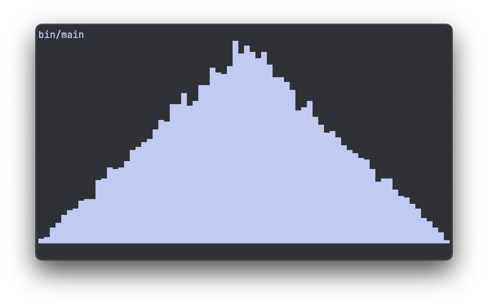
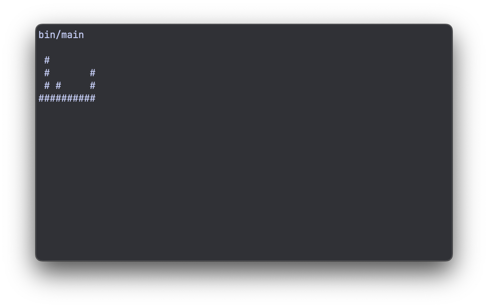
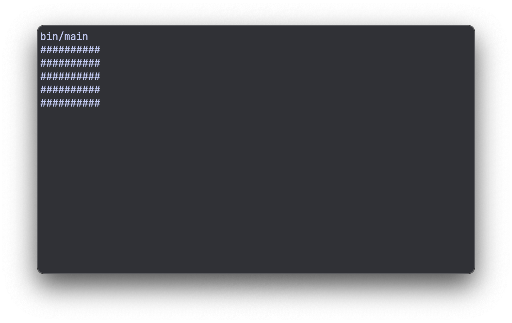
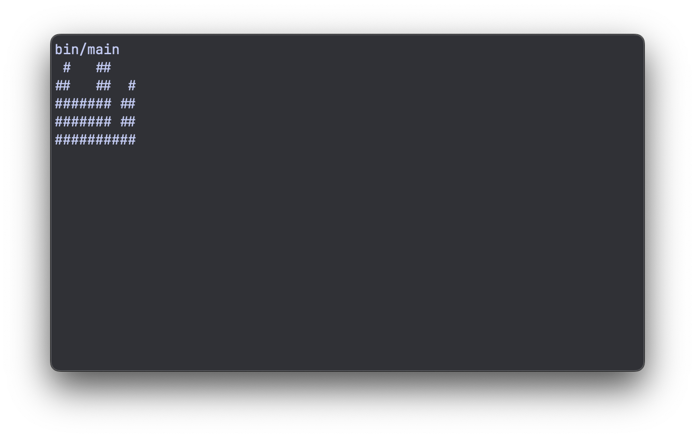
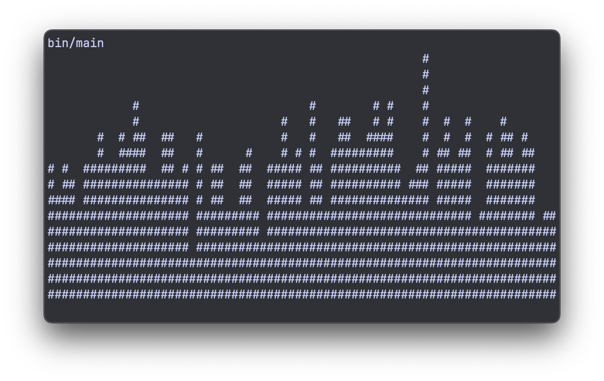
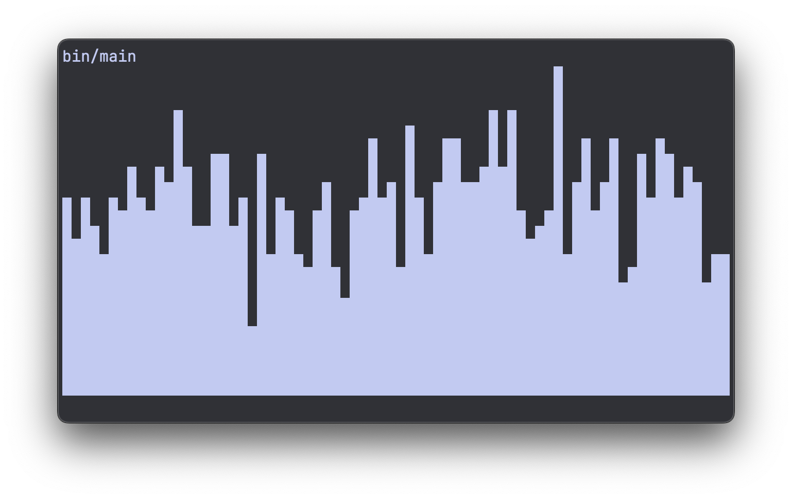
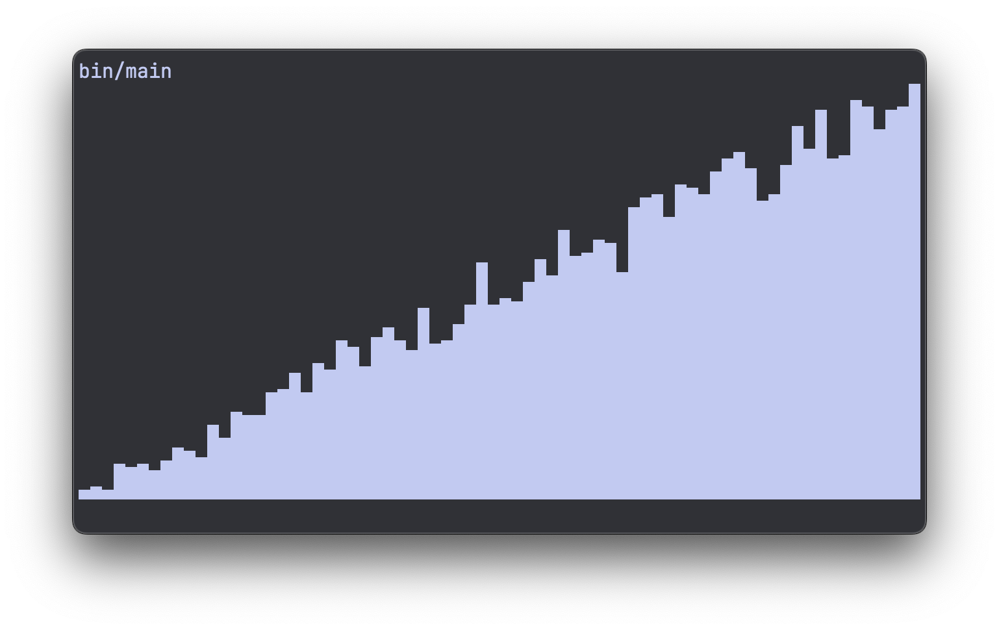
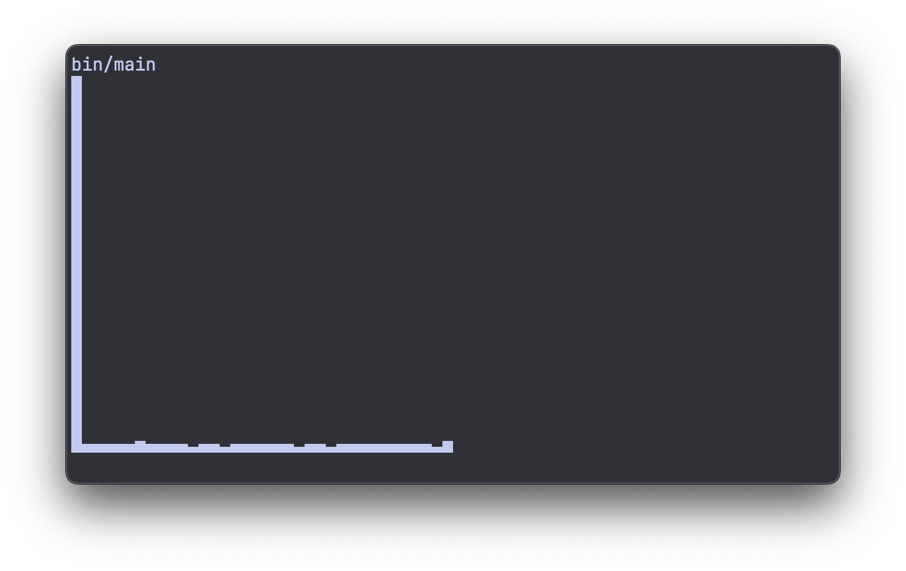
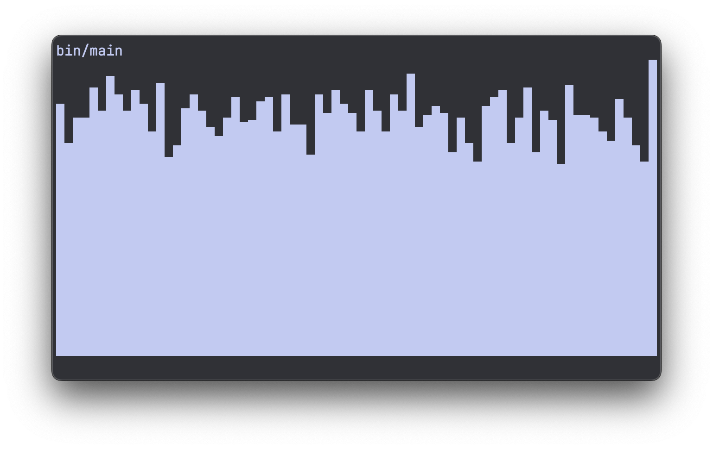
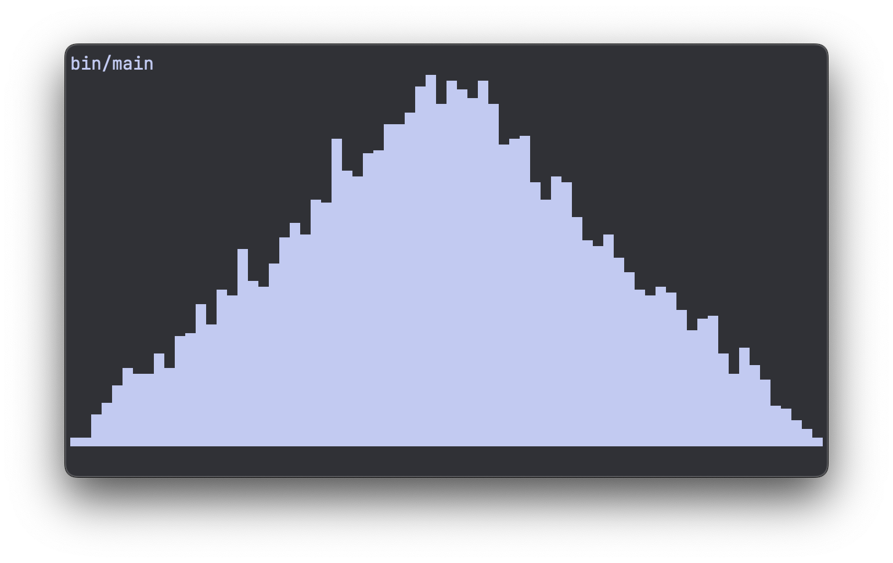

# Plotting histograms in the terminal

I was generating some random numbers the other day. And I really felt the urge to
visualize them. Just to get an intuition, like, what's the shape of the distribution? Is
it noisy or smooth?

When in Python, I would `pip install matplotlib` for this kind of stuff. But what are
the options when you're in C?

I ended up writing a plot library from scratch of course :) [plt.c on
github](https://github.com/vanderoost/plt.c)

<!-- more -->

I wanted to keep it super simple, so I chose to plot in the terminal, using unicode
block characters. No need for external graphics or imaging libraries.

This is what it looks like:



In the rest of this article, we'll walk through the process of writing this library.

I also recorded the entire process as a screencast:


## Generating test data

Before we can plot anything, we need something to plot. I want my utility to work with
simple float arrays. If we need other datatypes later we can always do this.

So let's generate some random floats:

```c
#include <stdlib.h>

#define SAMPLE_COUNT 16

int main(void) {
  float data[SAMPLE_COUNT];
  for (size_t i = 0; i < SAMPLE_COUNT; ++i) {
    data[i] = (float)random() / RAND_MAX;
  }

  return 0;
}
```

## Histogram buckets

To take a list of random numbers, and turn it into a histogram, we need to decide on our
"buckets".


Let's say all the little green dots are our random numbers, or samples. The buckets are
drawn as columns, and we just have to could how many samples fall in each bucket. That
will be the bar height of our histogram.

We can do that by looping over all samples:

```c
#define COLS 10

...

  size_t buckets[COLS] = {};
  for (size_t i = 0; i < SAMPLE_COUNT; ++i) {
    size_t bucket_ix = data[i] * COLS;

    buckets[bucket_ix]++;
  }
```

We initialize our `buckets` as a `size_t` array, initialized to zero with the `= {}`.

Then we loop over all samples, and for each decide which bucket it belongs to. Since
we're working with samples from 0.0 to 1.0, it's a simple multiply with the number of
columns `COLS`.


## First ugly plot

Now that we have bucket counts, we can try to plot them. Since we have *columns*, we
should also introduce the concept of *rows*. Rows and columns refer to the terminal
characters we can print. So plotting a 2D figure is simply a double loop over rows and
columns:

```c
#define ROWS 5

...

  for (size_t i = 0; i < rows; ++i) {
    size_t height = (rows - 1 - i);

    for (size_t j = 0; j < cols; ++j) {
      if (buckets[j] > height) {
        printf("#");
      } else {
        printf(" ");
      }
    }
    printf("\n");
  }
```

We hit every cell with our doubly nested loop. Then in each cell we decide whether we're
above or below the height/count of the bucket. If we're above, we print a space, if
we're below, we print a pound sign. Just an arbitrary character that fills up the cell.

This spits out:



If you squint your eyes, it kind of looks like a histogram..

But we can do better :)


## Autoscaling the Y-axis

One big problem with this approach is that we're not scaling the Y-axis at all. So when
our sample count increases, we end up plotting a full block where all bars max out.

This is what it looks like with `SAMPLE_COUNT` set to 100:



We can fix this by keeping track of the maximum bucket count:

```c
size_t bucket_max = 0;
for (size_t i = 0; i < COLS; ++i) {
  if (buckets[i] > bucket_max) {
    bucket_max = buckets[i];
  }
}
```

With this `bucket_max` and `ROWS`, we can scale the buckets to the right size for our
canvas:

```c
  for (size_t i = 0; i < COLS; ++i) {
    buckets[i] = (buckets[i] * ROWS) / bucket_max;
  }
```

Multiplying by `ROWS`, so increasing our rows will make the bars scale up. Dividing by
`bucket_max` so the highest bar will always be exactly `ROWS` high.

Now the height of the histogram automatically scales:




## Using the full terminal width

We've set our `COLS` to an arbitrary 10. We could make the tool really fancy and
auto-detect the width of the terminal, but I usually don't change my terminal width
much, so I'm ok with just hard-coding it.

But we can find out our width of the terminal using the `$COLUMNS` variable:

```console
% echo $COLUMNS
72
```

So I'll be using 72 from now on. And while we're at it, let's set `ROWS` to 16 and also
increase the number of samples to 1000:

```c
#define SAMPLE_COUNT 1000
#define ROWS 16
#define COLS 72
```

And now our histogram starts to get a bit more "definition":




## Unicode block elements

Instead of the arbitrary pound signs, we can do a lot better. By using [unicode block
elements](https://en.wikipedia.org/wiki/Block_Elements) we can 8x our vertical
resolution (without increasing rows).

We have 8 different block elements, going from 1/8 height (`U+2581`), all the way to a
full block (`U+2588`):

```
▁▂▃▄▅▆▇█
```

All we have to do now is figure out some logic that prints out the correct unicode
characters at the correct spot.

We will still print one character at a time, so the number of rows and columns doesn't
change. But we can now deal with 8 times more height levels.

And then there are 3 different situations for a character. The column height can either
be:

1. Under the current character: print a space
2. Above the current character: print a full block
3. Inside the current character: print one of the sub-blocks


The three situations are drawn in yellow here.

If we represent all 8 block characters in an array, we can use the index as the
"sub-block-height" and we prevent having to write a lot of if-else statements:

```c
  char *blocks[] = {
    " ",
    "\u2581",
    "\u2582",
    "\u2583",
    "\u2584",
    "\u2585",
    "\u2586",
    "\u2587",
    "\u2588",
  };
  size_t block_count = sizeof(blocks) / sizeof(*blocks) - 1;
```

As you can see, I've also added the space character in there. So we have a total of 9
elements in our array. I still want to do the math with 8 levels though. So when I
calculate `block_count` I subtract 1.

Then when we're autoscaling, we don't want to set the max bucket height equal to `ROWS`,
but to 8 times `ROWS`, so we multiply it with `block_count`:

```c
  for (size_t i = 0; i < cols; ++i) {
    buckets[i] = (buckets[i] * rows * block_count) / bucket_max;
  }
```

And then it's time for the plot loop:

```c
  for (size_t i = 0; i < rows; ++i) {
    size_t height = (rows - 1 - i) * block_count;

    for (size_t j = 0; j < cols; ++j) {
      int block_ix = buckets[j] - height;
      block_ix = block_ix < 0 ? 0 : block_ix;
      block_ix = block_ix > (int)block_count ? block_count : block_ix;

      printf("%s", blocks[block_ix]);
    }
    printf("\n");
  }
```

Our `height` is now also multiplied by the `block_count`.

And then we calculate the index `block_ix` which we then have to clamp betwen 0 and 8 to
make sure everything works.

And when we run it like this, we're plotting something that looks like a real histogram:



And maybe we should change the distribution a bit to really appreciate the extra
resolution this has bought us. We can take the square root of each random number, and
increase the sample count to 10,000:

```c
...

#include <math.h>

#define SAMPLE_COUNT 10000

...

int main(void) {
  float data[SAMPLE_COUNT];
  for (size_t i = 0; i < SAMPLE_COUNT; ++i) {
    data[i] = sqrtf((float)random() / RAND_MAX);
  }

  return 0;
}
```

Using `sqrtf` (square root for floats) from `math.h` we're getting a more interesting
distribution:



A plot like this would have never been possible with spaces and pound signs.


## Autoscaling the X-axis

We're almost done, but there still is one issue: If our random floats go outside the
0.0 - 1.0 range, we have a problem.

Let's go back to a uniform distribution, but subtract 0.5 to center the numbers around
0.0:

```c
  float data[SAMPLE_COUNT];
  for (size_t i = 0; i < SAMPLE_COUNT; ++i) {
    data[i] = (float)random() / RAND_MAX - 0.5f;
  }
```

That results in the following abomination:



We could either manually specify the range we want to plot our histogram at, or let it
auto-scale the x-axis as well. I prefer the latter. This allows us to just throw
anything at it, and the plot function will just figure it out.

So in order to do this, we need to keep track of the x-range (the minimum and maximum
value of our samples):

```c
  float x_min = data[0], x_max = data[0];
  for (size_t i = 1; i < SAMPLE_COUNT; ++i) {
    float val = data[i];

    if (val < x_min) {
      x_min = val;
    }

    if (val > x_max) {
      x_max = val;
    }
  }
  float x_range = x_max - x_min;
```

Now we have `x_min`, `x_max` and `x_range`. And we're going to do some basic math to
scale and shift the samples back into a 0.0 - 1.0 range, after which we can multiply
them with the number of columns `COLS`.

First we calculate the x-scale. And we guard against a range of 0.0 to avoid dividing by
zero:

```c
  float x_scale = x_range > 0.0f ? COLS / x_range : 0.0f;
```

With this, we can shift and scale each sample, before calculating which bucket it goes
into:

```c
  size_t buckets[COLS] = {};
  for (size_t i = 0; i < len; ++i) {
    size_t bucket_ix = (data[i] - x_min) * x_scale;
    bucket_ix = bucket_ix > COLS - 1 ? COLS - 1 : bucket_ix;

    buckets[bucket_ix]++;
  }
```

Subtracting `x_min` makes sure we shift the entire range to start from 0.0. Then
multiplying by `x_scale` scales it up to our number of columns.

After this, we make sure we don't exceed `COLS - 1` which would mean we access elements
outside of our `buckets` array.

This gets us back to a properly scaled histogram of our uniform distribution:




## Splitting the code into a library

Up until this point we've been cluttering up our `main` function. I'd like to clean it
up and end up with something like this:

```c title="main.c"
#include "plt/plt.h"
#include <stdio.h>
#include <stdlib.h>

#define SAMPLE_COUNT 10000
#define ROWS 16
#define COLS 72

int main(void) {
  float data[SAMPLE_COUNT];
  for (size_t i = 0; i < SAMPLE_COUNT; ++i) {
    float roll_a = (float)random() / RAND_MAX;
    float roll_b = (float)random() / RAND_MAX;

    data[i] = roll_a + roll_b;
  }

  plt_hist(data, SAMPLE_COUNT, ROWS, COLS);

  return 0;
}
```

A lot cleaner. Our plot functionality is now just one `plt/plt.h` include, and
one `plt_hist()` call.

Note that we also do two random rolls, and add them together. This gives quite an
interesting distribution:



And our `plt` library looks like this:

```c title="plt/plt.h"
#ifndef _PLT_H
#define _PLT_H

#include <stdlib.h>

void plt_hist(float *data, size_t len, size_t rows, size_t cols);

#endif // _PLT_H
```

```c title="plt/plt.c"
#include "plt.h"
#include <stdio.h>
#include <stdlib.h>

void plt_hist(float *data, size_t len, size_t rows, size_t cols) {
  // Get the x range
  float x_min = data[0], x_max = data[0];
  for (size_t i = 1; i < len; ++i) {
    float val = data[i];

    if (val < x_min) {
      x_min = val;
    }

    if (val > x_max) {
      x_max = val;
    }
  }
  float x_range = x_max - x_min;
  float x_scale = x_range > 0.0f ? cols / x_range : 0.0f;

  // Keep track of bucket counts
  size_t buckets[cols] = {};
  for (size_t i = 0; i < len; ++i) {
    size_t bucket_ix = (data[i] - x_min) * x_scale;
    bucket_ix = bucket_ix > cols - 1 ? cols - 1 : bucket_ix;

    buckets[bucket_ix]++;
  }

  // Find the max count
  size_t bucket_max = 0;
  for (size_t i = 0; i < cols; ++i) {
    if (buckets[i] > bucket_max) {
      bucket_max = buckets[i];
    }
  }

  // clang-format off
  char *blocks[] = {
    " ",
    "\u2581",
    "\u2582",
    "\u2583",
    "\u2584",
    "\u2585",
    "\u2586",
    "\u2587",
    "\u2588",
  };
  // clang-format on
  size_t block_count = sizeof(blocks) / sizeof(*blocks) - 1;

  // Scale heights
  for (size_t i = 0; i < cols; ++i) {
    buckets[i] = (buckets[i] * rows * block_count) / bucket_max;
  }

  // Plotting
  for (size_t i = 0; i < rows; ++i) {
    size_t height = (rows - 1 - i) * block_count;

    for (size_t j = 0; j < cols; ++j) {
      int block_ix = buckets[j] - height;
      block_ix = block_ix < 0 ? 0 : block_ix;
      block_ix = block_ix > (int)block_count ? block_count : block_ix;

      printf("%s", blocks[block_ix]);
    }
    printf("\n");
  }
}
```

---

That's it! Thanks for reading.

I'm maintaining it on github as [plt.c](https://github.com/vanderoost/plt.c) so feel
free to grab it from there.
