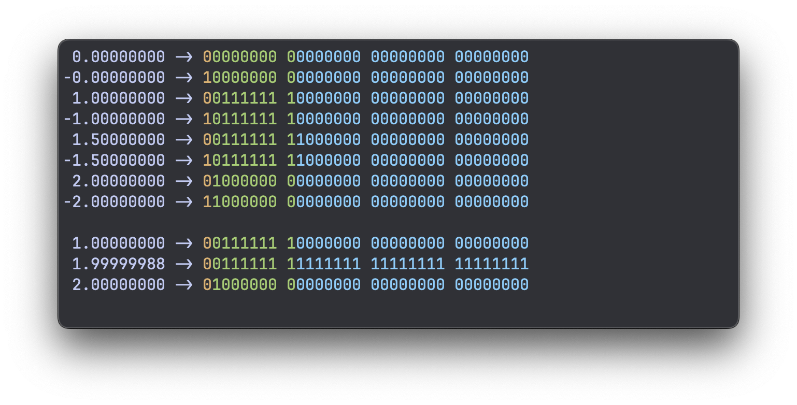

# How floats work

I don't always write C, but when I do, I tend to find myself learning _how things
work_.

In other languages, it's a lot more common to just import modules for everything. In C,
it's more conventional to "write it yourself". Write your own string library, write your
own data structures, etc.

It might not be the fastest way to get things done, but if your goal is to _learn_,
coding in C is very effective.

In this article I want to explore floating-point numbers (floats). Floats are a bit more
complicated than integers. It's quite easy to convert a bunch of bits to an (unsigned)
integer, but for floats this is not trivial.

<!-- more -->

So what I want to do is try to reverse engineer floats. Create some floats, look at what
their bits in memory look like, and figure out what does what.

## How many bits?

If we want to know what the bits of a float look like in memory, we first need to know
some very basic information: how many bits make a float?

The way to get the number of _bytes_ is by using `sizeof`:

```c
size_t float_bytes = sizeof(float);

printf("a float has %zu bytes\n", float_bytes);
```

This prints `a float has 4 bytes` on my system (and it will on most systems). There are
8 bits per byte, so a float has 4 * 8 = 32 bits.

## Accessing bits of integers

In C you can do bitwise operations to access individual bits. But this only works with
integers.

This is how you can access the first (lowest) bit of an unsigned integer called `u`:

```c
uint32_t u = 123;
uint32_t bit = u & 1u;

printf("bit: %u\n", bit);
```

I'm using the type `uint32_t` here. This is an unsigned 32-bit integer. Unsigned
integers are the easiest to convert from binary to decimal as we don't have to worry
about the sign. And it's 32 bits, the same size as a float. This will become relevant
later.

We're using the bitwise operator `&` (AND), which compares two integers bit by bit, and
returns a third integer bit by bit (or bitwise).

So if you do `a & b` and `b` is the number 1, which corresponds to
`00000000 00000000 00000000 00000001` in binary, you're basically only focusing in on
the first (smallest, rightmost) bit, masking out the rest. If the smallest bit of `a` is
a 0, the result is 0; if it's a 1, the result is 1.

Ok, so how do you access the other bits?

If you do a bitwise AND with the second bit:

`00000000 00000000 00000000 00000010`

You will focus on the second bit, but you will get back either a 0, or the value of that
bit (2).

This second bit corresponds to 2 in decimal, so you can do an `& 2` on it:

```c
uint32_t u = 3;
uint32_t bit = u & 2;

printf("bit: %u\n", bit);
```

But this returns a 2.

If we just want to get back a 0 or a 1, we can instead _shift_ the number to move the
bit we want to see to the lowest place, and then AND it with a 1.

So if we want to get the second bit, we do this:

```c
uint32_t u = 3;
uint32_t bit = (u >> 1) & 1;

printf("bit: %u\n", bit);
```

This now returns a 1 instead of a 2.

We can generalize this and provide a bit index `bit_ix` that can range from 0 to 31 for
32-bit numbers.

```c
uint32_t u = 3;
size_t bit_ix = 1;
uint32_t bit = (u >> bit_ix) & 1;

printf("bit: %u\n", bit);
```

I'm using a `size_t` type here for the bit index. This is just something I usually do
for sizes, indices, etc.

Now we have a good way to access every individual bit of an int.

Let's print all of them to the screen:

```c
uint32_t u = 3;

for (size_t i = 0; i < 32; ++i) {
  size_t bit_ix = 31 - i;
  uint32_t bit = (u >> bit_ix) & 1;

  printf("%u", bit);
}
printf("\n");
```

```console
00000000000000000000000000000011
```

This prints out a bunch of bits: that's what the memory looks like for `3`.

We have to sort of invert the `bit_ix`. We start at 31 and walk back to 0, so that we
print the highest bits first and go down to the lowest bits. Just like how we treat
decimal numbers as well.

## Accessing float memory like it's an int

These bitwise operations won't work on floats:

```c
float f = 3.0f;
uint32_t bit = f & 1u;

printf("bit: %u\n", bit);
```

```console
error: invalid operands to binary expression ('float' and 'unsigned int')
```

So we have to figure out a way to convert the float into an int.

If we do this:

```c
float f = 1.0f;
uint32_t u = f;
```

The code compiles, but the float is converted to a `uint32_t`, which means the bits in
memory are all changed. A `1.0f` float becomes a `1` int because that makes the most
sense.

But what we want is to look at the bits of a float as if the memory belongs to an int,
such that we can access the bits.

There are two approaches to do this:

1. Pointers
2. Unions

Let's try both.

### The pointer method

If we convert a float to an int, we're interpreting the float as an int, and we set the
memory that belongs to the int to whatever the float represents "numerically".

Instead, what we want is to create a float, and access its memory as if those 32 bits
belong to a `uint32_t`.

In order to do that, we first create a float:

```c
float f = 1.0f;
```

Then we create a pointer to that float's address:

```c
float *fp = &f;
```

Then we can create a `uint32_t` pointer, which also just points to a place in memory. We
can cast the float pointer to be a `uint32_t` pointer and point to the same thing:

```c
uint32_t *up = (uint32_t *) fp;
```

And then we can create a `uint32_t` and set it equal to whatever the `uint32_t` pointer
is pointing to (the float memory).

```c
uint32_t u = *up;
```

Now we have created a `uint32_t` from a float, but without converting the value. We only
cast the pointer types, which doesn't mess with the memory.

So all together, we can now print out the individual bits of a float:

```c
float f = 1.0f;
float *fp = &f;
uint32_t *up = (uint32_t *) fp;
uint32_t u = *up;

for (size_t i = 0; i < 32; ++i) {
  if (i % 8 == 0) {
    printf(" ");
  }

  size_t bit_ix = 31 - i;
  uint32_t bit = (u >> bit_ix) & 1;

  printf("%u", bit);
}
printf("\n");
```

As you can see, I'm printing out a space every 8th bit, to group the bits as bytes:

```console
00111111 10000000 00000000 00000000
```

And that's what the float `1.0f` looks like in memory!

There is a catch though. Technically, this breaks C's _strict aliasing_ rule: you're not
supposed to read an object through a pointer of a different type. We're being sneaky
hackers here. Officially, it's undefined behavior, and with optimizations turned on, the
compiler might change the behaviour. In practice it usually works, but that's one more
reason to prefer the next method.

### The union method

This is, in my opinion, the easier method to understand, provided you know what a union
is.

The syntax for a union looks just like the syntax for a struct in C:

```c
typedef union {
  float f;
  uint32_t u;
} Bits;
```

The difference between a struct and a union is that a struct places all its members
sequentially in memory:


Unions on the other hand place the members "on top of" each other, using the same
memory:


So unions allow us to access the same memory bits as different types. This is exactly
what we want, and unlike the pointer method, it's allowed by the C standard (but not in
C++, by the way).

Accessing a float's bits can now be simplified using our `Bits` union:

```c
float f = 1.0f;

Bits bits = {.f = f};

for (size_t i = 0; i < 32; ++i) {
  if (i % 8 == 0) {
    printf(" ");
  }

  size_t bit_ix = 31 - i;
  uint32_t bit = (bits.u >> bit_ix) & 1;

  printf("%u", bit);
}
printf("\n");
```

And this is the way I like to do it.

So let's put this into a reusable function `print_float_bits` where we pass in a float
and get it to print the 32 bits to the console.

```c
void print_float_bits(float f) {
  printf("%f ->", f);
  Bits bits = {.f = f};
  for (size_t i = 0; i < 32; ++i) {
    if (i % 8 == 0) {
      printf(" ");
    }

    size_t bit_ix = 31 - i;
    uint32_t bit = (bits.u >> bit_ix) & 1u;
    printf("%u", bit);
  }
  printf("\n");
}
```

This function prints out the float first, then the 32 bits (4 bytes) that make up this
float:

```console
1.000000 -> 00111111 10000000 00000000 00000000
```

## Experiments

Before doing any experimentation, the one thing I know about floating-point numbers is
that they use sort of a binary version of scientific notation. Scientific notation is
some coefficient `c`, multiplied by 10 to the power of some exponent `e`: `c × 10^e`.

The binary version is simply `c × 2^e`.

This means that if you increase the exponent by 1, the final number is doubled.

So let's see what happens if we print 0.5, 1.0, and keep doubling a few more times:

```c
float floats[] = {0.5f, 1.0f, 2.0f, 4.0f, 8.0f};

for (size_t i = 0; i < sizeof floats / sizeof *floats; ++i) {
  print_float_bits(floats[i]);
}
```

```console
0.500000 -> 00111111 00000000 00000000 00000000
1.000000 -> 00111111 10000000 00000000 00000000
2.000000 -> 01000000 00000000 00000000 00000000
4.000000 -> 01000000 10000000 00000000 00000000
8.000000 -> 01000001 00000000 00000000 00000000
```

If you look closely at the bits, you can see there is a certain sequence of bits that
keeps incrementing as we're doubling the float (the first 9 bits). The 9th bit has this
0-1-0-1 even/odd flipping pattern.

These might be the exponent bits we're seeing.

Another interesting thing we can do is look at 1.0, then double it to 2.0, then take the
bits of 2.0 as an integer and subtract one. This should give us the highest possible
float below 2.0.

To see this better, I'm increasing the number of decimal places to 8 like so:

```c
...
printf("% .8f ->", f);
...
```

Note that I'm also adding a space in the format (`% .8f`). This reserves a space for the
`-` sign, even if we have a positive number, which keeps all the numbers aligned.

```console
 1.00000000 -> 00111111 10000000 00000000 00000000
 1.99999988 -> 00111111 11111111 11111111 11111111
 2.00000000 -> 01000000 00000000 00000000 00000000
```

When you look at the bits, the 1.0 and the 1.999... float both seem to have the same
exponent bits, but in the 1.999... version, all the trailing zeros have flipped to ones.

Looking at this, it would make sense that all these bits that were flipped between 1.0
and 1.999... are the coefficient bits, or "mantissa" bits.

How about negative numbers? We can easily test a bunch of negative numbers, and see what
happens:

```console
 1.00000000 -> 00111111 10000000 00000000 00000000
-1.00000000 -> 10111111 10000000 00000000 00000000
 1.50000000 -> 00111111 11000000 00000000 00000000
-1.50000000 -> 10111111 11000000 00000000 00000000
 2.00000000 -> 01000000 00000000 00000000 00000000
-2.00000000 -> 11000000 00000000 00000000 00000000
```

Seems like it's the first bit. If it's 0, the number is positive; if it's a 1, the
number is negative.

This rule even holds true for the number 0.0:

```console
 0.00000000 -> 00000000 00000000 00000000 00000000
-0.00000000 -> 10000000 00000000 00000000 00000000
```

You might have seen negative zero (-0.0) floating around in terminal outputs. This is
where it comes from: there is a literal negative zero float, distinct from the normal
zero.

If we check for equality, the program says they are equal, which makes sense. But I
wouldn't have been surprised if it had said false. It's generally not a good idea to
compare floats for equality.

So, what we've found is:

- The highest (leftmost) bit is the sign
- The next 8 highest bits are the exponent
- The last (lowest) 23 bits are the coefficient (a.k.a. mantissa)

## Fancy terminal colors

Now that we know each bit's role, we can give them different colors.

In C, these are some macros I use to be able to print a few terminal colors:

```c
#define ESC "\033"
#define RESET ESC "[0m"
#define FG_GRN ESC "[32m"
#define FG_YEL ESC "[33m"
#define FG_CYA ESC "[36m"
```

And in the `print_float_bits` function, I'm using them like this:

```c
void print_float_bits(float f) {
  printf("% .8f ->", f);
  Bits bits = {.f = f};
  for (size_t i = 0; i < 32; ++i) {
    if (i % 8 == 0) {
      printf(" ");
    }

    if (i == 0) {
      printf(FG_YEL);
    } else if (i == 1) {
      printf(FG_GRN);
    } else if (i == 9) {
      printf(FG_CYA);
    }

    size_t bit_ix = 31 - i;
    uint32_t bit = (bits.u >> bit_ix) & 1u;
    printf("%u", bit);
  }
  printf(RESET "\n");
}
```

This prints out floats like this:



Yellow is the sign bit, the exponent bits are green, and the mantissa is blue.

## Decoding the bits

We now know which bits do what, but how do they combine into the actual number? There
are two small tricks:

- The exponent is stored with a _bias_ of 127. So the real exponent is the stored value
  minus 127. For 1.0, the exponent bits are `01111111` = 127, and 127 - 127 = 0.
- The coefficient always starts with an invisible `1.` in front of it, because in binary
  scientific notation, the leading digit is always 1 anyway. So there's no point in
  storing it.

Put together:

`value = (-1)^sign × 1.mantissa × 2^(exponent - 127)`

Let's check 1.5: the sign is 0, the exponent bits are 127 (so 2^0 = 1), and the
mantissa bits are `1000...`, which makes the coefficient `1.1` in binary. That's
1 + 1/2 = 1.5. So we get 1 × 1.5 × 1 = 1.5.

## Special floats

We've been defining floats, and then looking at their binary representation.

How about we flip it: define some bits, and look at which float we get? We can define
integers in binary format using the `0b...` syntax. This is officially part of C since
C23, but GCC and Clang have supported it as an extension for much longer.

```c
Bits bits;
bits.u = 0b00000000000000000000000000000000;
print_float_bits(bits.f);
```

```console
 0.00000000 -> 00000000 00000000 00000000 00000000
```

If we set all bits to 0, we get a float of 0.0. We already knew this.

How about we flip all bits to 1s?

```c
bits.u = 0b11111111111111111111111111111111;
print_float_bits(bits.f);
```

```console
nan -> 11111111 11111111 11111111 11111111
```

We get `nan`! (On Linux you might see `-nan`, because the sign bit is set.)

Let's see what we get if we only set the exponent bits to 1:

```c
bits.u = 0b01111111100000000000000000000000;
print_float_bits(bits.f);
```

```console
 inf -> 01111111 10000000 00000000 00000000
```

We get `inf`!

Can we flip the sign of `inf`? Let's try setting the highest bit to 1:

```c
bits.u = 0b11111111100000000000000000000000;
print_float_bits(bits.f);
```

```console
-inf -> 11111111 10000000 00000000 00000000
```

Yes, we can :) So as you can see, all those strange flavors of numbers like `nan` and
`inf` are nothing more than specific bit patterns.

---

That's where I'll leave it for now. I hope that was helpful. I much prefer this method
of exploring certain topics by hacking away at them, instead of reading the
documentation.
