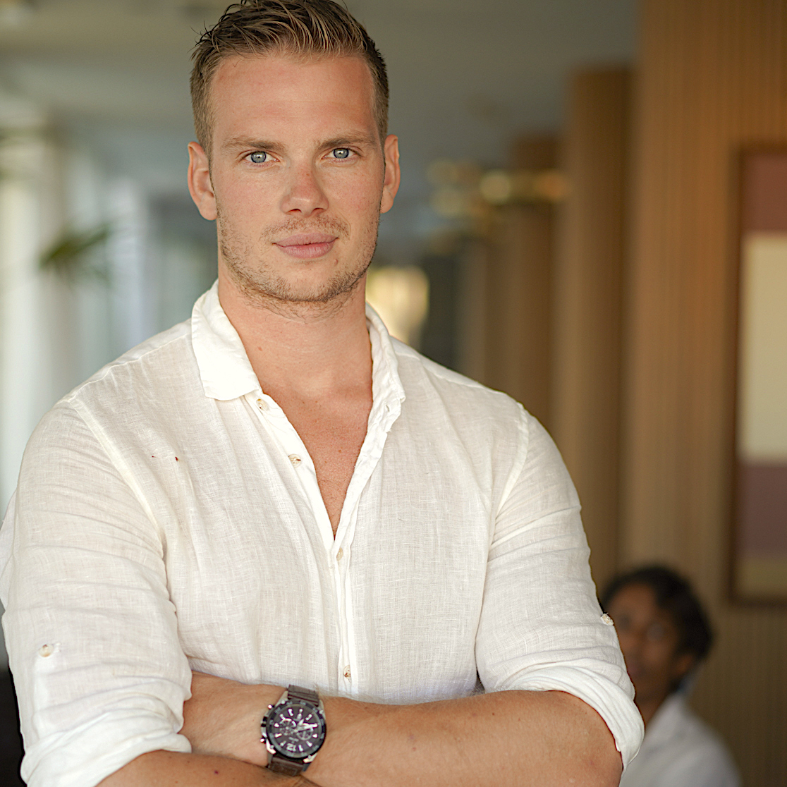

# Automate your business operations

### I have automated business workflows for the past 12 years

- Are you struggling to keep up with the rapid pace of AI innovation?

- Do you feel like the more you adapt AI, the busier you get?

- Need someone who understands both technical and business perspectives?

[Book an Intro Call :material-arrow-top-right:](https://calendly.com/vanderoost/introduction-call){ .md-button .md-button--primary :target="_blank"}

{ .profile-image alt="Portrait of Richard van der Oost, AI entrepreneur and educator" }

## About me

Hi! I'm Richard, a technical founder from the Netherlands.

I learned how to write software by hiring software engineers. For the past 12 years I've been turning repetitive manual workflows into software that runs itself.

## Why work with me?

I identify bottlenecks in companies, and put automated systems in place to remove friction. This allows teams to focus on what matters, without wasting time on repetitive busywork.

Over the past 12 years, I’ve designed distributed cloud computing infrastructure, 3D production pipelines, digitalized 3D printing processes, and automated online marketing campaigns.

If you’re interested in working together, [book a call](https://calendly.com/vanderoost/introduction-call).

Here's how I can help you save time and make more money:

-   :fontawesome-solid-building-user:{ .lg .middle } Proven Business Experience

    ---

    As the founder of Blendergrid, I bring entrepreneurial insight to every project. I have shipped real software and always take full responsibility for delivering value to my clients while making a profit. I understand both the technical and business sides of workflow automations, ensuring solutions that deliver real ROI and align with your business goals.

-   :material-youtube:{ .lg .middle } Educator & Communicator

    ---

    My experience in creating online training videos means I can break down complex technical concepts into clear, actionable insights. You'll always understand the 'why' behind technical decisions and get clear progress updates.

-   :material-school:{ .lg .middle } Industry Expert

    ---

    With over a decade in SaaS experience, I bring battle-tested expertise to your projects. My solutions are built on real-world experience, not just theory.

-   :material-rocket:{ .lg .middle } Fast Implementation

    ---

    I specialize in rapid development and deployment of AI solutions. Using modern tools and proven frameworks, I can help you move from concept to production faster, giving you a competitive edge in today's fast-paced market.

## What my past clients say about my work

-   :material-format-quote-open:{ .lg .middle } Tyler Disney

    Lead Visualization Engineer at Integral Group

    ---

    "I'm glad you guys seem to be taking the approach of making something simple that works really well, and adding features slowly. I love being able to rely on your softwware to 'just work' when I need it to."

-   :material-format-quote-open:{ .lg .middle } Ryan Vautier
    
    3D artist at ryanvautier.com

    ---

    "Without a shadow of a doubt the best render farm I've ever used. The customer support has been absolutely incredible, and they've gone above and beyond to help me with every single question I've had. Not only an amazing render farm, but also quite clearly run by incredible people!"

-   :material-format-quote-open:{ .lg .middle } Heather Meade
    
    3D animator at RainDropProducts.com

    ---

    "Thank you so much! I can't tell you how much of a lifesaver this has been for us! Our computers wouldn’t have been able to handle this many frames in the amount of time we had. Your render farm was fast and affordable, and next time we have a project this big, I think we’ll probably use your service again instead of trying to scramble to get things done. Thank you again!"

## Frequently asked questions

??? note "How quickly can you start working on my project?"
    I can typically begin new projects within 1-2 weeks of contract signing. For urgent matters, I maintain some flexibility for rapid response situations and can potentially start sooner - just let me know your timeline during our initial consultation.

??? note "Do you require a minimum project size or commitment?"
    While I can accommodate projects of any size, I find that engagements of at least 20 hours allow for meaningful impact. This gives us enough time to understand your situation, implement solutions, and deliver actionable results. We can start with a small pilot project to ensure we're a good fit.

??? note "How do you handle data security and confidentiality?"
    I take data security extremely seriously. I sign comprehensive NDAs before starting any project, use enterprise-grade encryption for all data transfers, and follow industry best practices for data handling. I can also work within your existing security infrastructure and policies.

??? note "How do you communicate progress and results?"
    You will get weekly progress updates and regular check-in meetings. You'll receive detailed documentation of all analyses, findings, and recommendations. For ongoing projects, I provide interactive dashboards and reports that allow you to track progress and results in real-time.

-   :material-coffee:{ .lg .middle } Let's have an online coffee!

    ---
    
    Want to see if we're a match? Let's have a chat. Schedule a free 30-minute strategy session to discuss your automation challenges.

    [Book an Intro Call :material-arrow-top-right:](https://calendly.com/vanderoost/introduction-call){ .md-button .md-button--primary }

