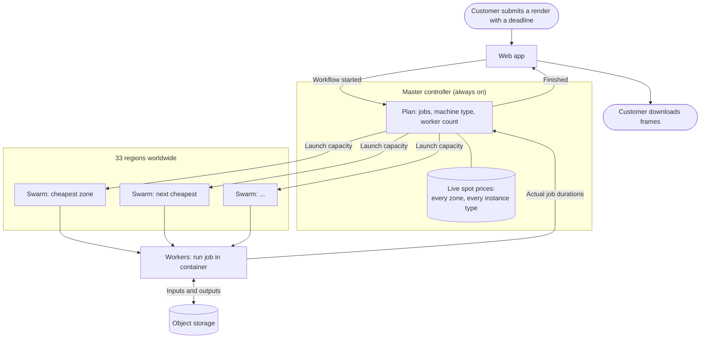

# Automated cloud computing infrastructure

!!! abstract "Summary"
    **Client**: Blendergrid (my own company)  
    **Website**: [blendergrid.com](https://blendergrid.com){ target="_blank" }  
    **Industry**: Cloud computing / 3D rendering

    **Impact metrics**:

    <!-- TODO: replace the bracketed numbers with real ones, see questions at the
         bottom of this file. Everything unbracketed is verifiable from the system
         itself. -->

    - One always-on machine when idle, hundreds of cores within minutes when a
      customer hits render
    - 33 AWS regions and every availability zone inside them are priced and
      scheduled against continuously
    - Runs on spot capacity rather than on-demand, at roughly 15% of the list price
    - Zero human involvement between a customer clicking render and the finished
      frames landing in their account
    - 5,000 renders delivered, 84,000 compute hours scheduled since launch

Blendergrid renders 3D animation for Blender artists and studios. A customer uploads a
project, gets a price and a deadline, and picks one. Everything after that is compute:
thousands of frames that each need a machine, for as short a time as possible, at the
lowest cost that still meets the promised deadline.

The Swarm Engine is the system that makes that promise keepable. It takes a workflow
with a deadline, decides where in the world to run it, rents the machines, runs the
jobs, and gives everything back when it's done.

## Business Problem

Rendering is the cleanest possible case of a workload that shouldn't need owned
hardware: it's bursty, it's embarrassingly parallel, and demand is impossible to
predict. A customer might submit nothing for a week and then a 4,000-frame animation
on a Friday night.

That leaves the usual bad trade-off:

1. **Own or rent fixed capacity.** You pay for it 24/7 and use it a fraction of the
   time. The idle hours are the entire margin.
2. **Size for the average.** Every burst turns into a queue, and the customer with the
   deadline is the one waiting.
3. **Size for the peak.** Now you're paying peak prices for capacity that's idle most
   of the month.

Cloud compute solves the elasticity part, but naively used it just moves the problem:
on-demand instances cost several times what the same machine costs on the spot market,
and a single region regularly has no spare capacity of the type you want at any price.

The observation the whole system is built on: at any moment there are tens of thousands
of distinct prices for the same compute. Every combination of region, availability
zone, and instance type is its own market, and they all move independently, all day.
Nobody can hand-pick from that. But a scheduler can, if you give it the prices and a
deadline to optimise against.

The catch is that cheap capacity is *interruptible* capacity. Spot machines can be
taken away with two minutes' notice, and regions refuse to give you capacity at all.
Any system that wants the price has to treat losing a machine mid-render as a normal
Tuesday, not an incident.

## Technical Solution

The design goal was a system that nobody operates. Not "easy to operate" but actually
unattended, including on the days when a region goes dark or a customer submits ten
times the usual volume.

### The principles behind the build

These are the parts that transfer to any other infrastructure problem:

**Buy compute like a commodity, not like a subscription.** Prices for identical
machines vary by a large multiple across regions and zones, and change continuously. A
process that polls every market and always places work at the current cheapest point
turns a fixed cost into a variable one.

**Assume every machine will disappear.** Jobs are individually reservable, restartable,
and idempotent: inputs come from object storage, outputs go back to it, and nothing of
value lives on a worker. Losing a node costs one frame's progress, so the system can
use the cheapest, least reliable capacity on the market without putting a deadline at
risk.

**Make every component a reconciliation loop.** Nothing in the system is a script that
runs once and hopes. Each loop reads the desired state (open workflows, target worker
counts, required managers), reads the actual state (running nodes, queued jobs, live
swarms), and closes the gap. A missed event or a crashed process self-corrects on the
next pass instead of leaving the system stuck.

**Predict, then correct.** Job durations are unknown up front and vary wildly within a
single project. Rather than guessing once, the system predicts remaining job durations
from the ones already finished, tracks how uncertain each prediction is, and re-derives
the worker count it needs on every cycle.

**Push decisions to where the information is.** The central controller decides *what*
should run and *roughly how much* capacity it needs. Each datacenter decides which
specific jobs its own workers pull next, based on what its queues and machines are
actually doing. Global coordination happens through job reservations, so two
datacenters can never render the same frame.

**Scale to zero, honestly.** When there's no work, the fleet drains itself down to a
single cheap always-on node. Workers monitor their own usefulness and shut themselves
down when they stop being productive, because on a per-second billing model an idle
machine is pure loss.

### How it works

| Stage | What happens |
| --- | --- |
| **Workflow submitted** | The web app publishes an event: the render, its jobs, and its deadline. |
| **Planning** | The controller breaks the workflow into executions and jobs, picks the machine type that fits the project's memory and device requirements, and derives how many workers are needed to make the deadline. |
| **Market lookup** | Live spot prices for every instance type, in every zone of every region, are kept continuously up to date in the global state. |
| **Placement** | Capacity is launched at the cheapest points on the market that satisfy the requirements, falling back down the price-sorted list when a zone reports no capacity. |
| **Reservation** | Each datacenter claims jobs for itself, deadline-first, keeping its local queues just full enough to keep its workers busy and no fuller. |
| **Execution** | Workers run each job in a container: pull inputs from object storage, render, push results back, report timings. |
| **Learning** | Real job durations feed the duration model, which updates the predictions and the required worker count for what's left. |
| **Wind-down** | As work runs out, excess workers are drained and terminated; the fleet returns to a single always-on node. |

### The interesting problems

**Deciding how much capacity a deadline needs.** The naive version of launching
everything to finish fast, is also the most expensive. On the other hand, the version
that under-provisions misses the promise. The system continuously estimates the
remaining work from the jobs that have already finished, and adjusts the target worker
count as the picture sharpens. Early frames are effectively probes: they cost the same
as any other frame and they buy the information needed to size the rest of the render.

**Predicting job durations that nobody knows.** Within one animation, a frame can take
20 seconds or 20 minutes, and the pattern is smooth but unknown. Rather than a flat
average, durations for unfinished jobs are interpolated from the measured ones, with an
uncertainty that grows with distance from anything actually observed. That uncertainty
is used directly: it's what makes the worker-count estimate pessimistic in the right
places rather than optimistic everywhere.

**Coordinating datacenters that can't see each other.** Swarms in 33 regions all draw
from the same pool of pending jobs. Reservations are conditional writes against the
shared store, so a job is claimed by exactly one swarm. When a swarm dies mid-render,
its reservations are detected as stale and released back into the pool, and another
region picks them up.

**Making failure boring.** Regions run out of capacity; spot nodes get reclaimed; a
machine boots and never joins the cluster. Each of these is handled by a loop rather
than an alert: zones that report no capacity go into a cooldown and the next-cheapest
is tried, nodes that fail to join shut themselves down, jobs whose worker vanished get
requeued, and swarms that stop sending heartbeats get torn down and rebuilt.

## Results & Impact

- **The cost base became variable.** Spend tracks rendering demand almost exactly.
  There is no idle fleet to amortise, so a quiet week costs close to nothing and a busy
  week pays for itself.
- **Compute is bought at spot prices worldwide** rather than on-demand prices in one
  region, on infrastructure that treats interruption as routine.
- **Capacity is no longer a constraint on sales.** A render ten times the usual size is
  a scheduling decision, not a purchasing decision.
- **Availability comes from breadth.** When a region has no capacity or fails outright,
  work moves to the next-cheapest option automatically. There is no single datacenter
  whose bad day becomes the customer's bad day.
- **It runs itself.** The system has been in production since [YEAR], operated by
  nobody. Renders that arrive overnight are placed, executed, and delivered without a
  person in the loop.

The strategic effect is bigger than the cost saving. Because capacity is rented per
second and priced globally, the business can quote a price and a deadline for a job of
almost any size without owning anything. Growth doesn't require capital, and a slow
month doesn't hurt.

## Visual Assets

*Capacity is rented where it is cheapest right now, and returned the moment the work
runs out. Measured job durations feed straight back into how much capacity the next
minute needs.*

<!-- TODO: add real visuals alongside the diagram. Strongest candidates, in order:
     1. A Gantt chart from tools/gantt-workflow.py or gantt-node-lifecycle.py showing
        nodes spinning up, rendering, and terminating over a real workflow. This is the
        single most convincing image the system can produce.
     2. A spot price map / spread across regions, showing how much variation the
        scheduler is exploiting.
     3. A screenshot of the Blendergrid render progress view from the customer side.
     Drop files in docs/assets/ and reference them as ../../assets/<name>. -->

## Tech Stack

**Python** across every service: the controller, the per-datacenter managers, and the
workers. NumPy and SciPy do the duration prediction and worker-count maths.

**AWS EC2 spot capacity** in 33 regions is the compute itself, launched and terminated
programmatically rather than declared statically, because the fleet changes shape every
few minutes.

**Terraform** manages the static infrastructure that has to exist in every region
before anything can run there: networking, security groups, keys, images. Adding a
region is a config change, not a project.

**DynamoDB** holds the global state: workflows, executions, jobs, live prices, node
supplies. All with conditional writes providing the job reservations that keep 33
regions from colliding.

**SNS and SQS** carry every event between the web app, the controller, and the
datacenters. Publishers don't know who's listening, so a new datacenter is a
subscription rather than a code change.

**Docker Swarm and Redis (RQ)** run the local cluster inside each datacenter: managers
hold the queues, workers pull jobs and run each one in an isolated container.

**S3** is the only place that job inputs and outputs live, which is what makes losing a
worker mid-job a non-event.

**ECS** runs the always-on controller, **CloudWatch** collects logs from every node in
every region, and **Sentry** catches what the loops can't.

## What this looks like in other businesses

The rendering specifics are incidental. This shape recurs wherever a business needs a
lot of compute some of the time:

- Demand is spiky and hard to predict, so capacity is sized for the peak and paid for
  during the trough.
- The work is parallel, but the infrastructure isn't elastic, so bursts become queues
  and queues become missed commitments.
- The cheapest compute on the market goes unused because the system can't tolerate
  losing a machine.
- Scaling the business means buying hardware or reserving instances, which means
  growth needs capital and a forecast.

The fix has the same shape every time: make the work restartable so that cheap,
interruptible capacity becomes usable; treat the cloud as a live market rather than a
place you rent a fixed number of servers; and build every component as a loop that
reconciles reality against intent, so the system recovers instead of paging someone.
What you get isn't just a lower bill, but the ability to promise a customer a deadline
for a job of any size, without owning a thing.

-   :material-coffee:{ .lg .middle } Let's sit down for a virtual coffee!

    ---

    Want to see if we're a match? Let's have a chat and find out. Schedule a free
    30-minute strategy session to discuss your automation challenges and explore how
    we can work together.

    [Book Free Intro Call :material-arrow-top-right:](https://calendly.com/vanderoost/introduction-call){ .md-button .md-button--primary }

