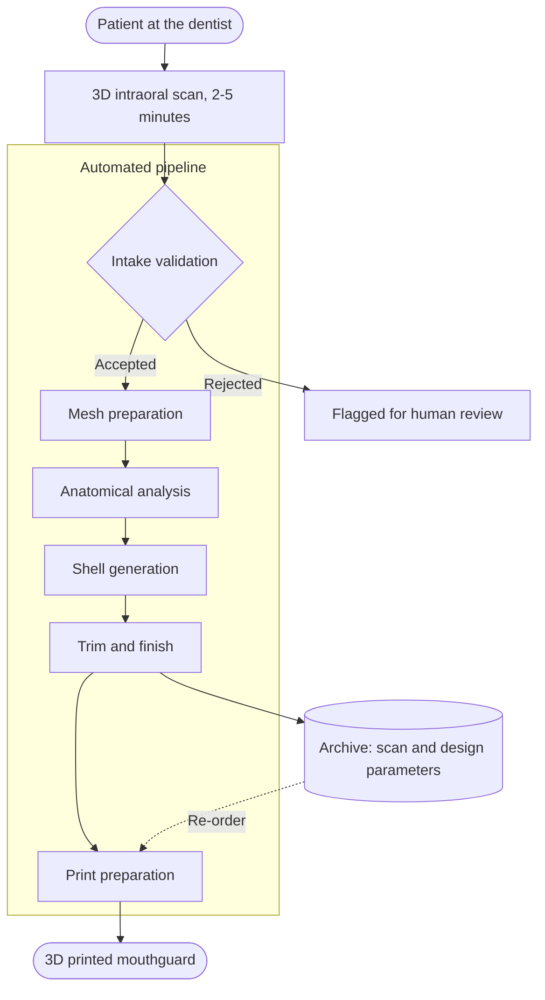

# Automating a dental production pipeline

!!! abstract "Summary"
    **Client**: Clik.Fit  
    **Website**: [clik.fit](https://clik.fit){ target="_blank" }  
    **Industry**: Dental appliances / additive manufacturing

    **Impact metrics**:

    - 93% less manual labour per mouthguard
    - 62% shorter lead time from patient visit to finished product
    - €300,000 projected annual production savings at full volume
    - Every design reproducible from a stored scan, so a re-order needs no new
      patient visit

Clik.Fit set out to replace the way custom mouthguards have been made for the last sixty
years. Instead of a dental technician shaping a guard by hand over a plaster model, a
patient gets a 3D intraoral scan at the dentist and the finished guard comes off a 3D
printer.

That only works if everything between those two points happens by itself. I built that
part: the digital pipeline that takes a raw intraoral scan and produces a print-ready
mouthguard design, with no manual modelling step in between.

## Business Problem

The conventional process is almost entirely manual, and every step is a place where
time, cost, or accuracy leaks away:

1. The dentist takes a physical impression, held in the patient's mouth. Uncomfortable,
   and quality varies with how it was taken.
2. The impression is shipped to a dental lab and cast into a plaster model. (this often
   damages the impression)
3. A technician trims the model, forms the mouthguard over it, and finishes it by hand.
4. The guard is shipped back, fitted, and adjusted if the fit is off.
5. If it's lost, damaged, or outgrown, the whole cycle starts again from step one.

The result is a product that takes weeks, costs a lot in skilled labour, and varies in
quality depending on who made it. Re-orders are as expensive as first orders, because
nothing from the first one was kept.

The important observation is that none of this work is *inherently* manual. A mouthguard
is a geometric object derived from the shape of someone's teeth. The reason it was made
by hand is that the input (the shape of the mouth) only existed as a physical object.
Intraoral scanners changed that. Everything downstream had been waiting for it.

## Technical Solution

The goal was to treat the mouthguard as a deterministic function of the scan: same scan
in, same design out, every time. That reframes the problem from "how do we help
technicians work faster" to "what exactly does a technician decide, and can we write it
down".

### The principles behind the build

These are the part that transfers to any other process:

**Digitise the input first.** Nothing downstream can be automated while the input is a
physical object. The intraoral scan is what made the rest possible; it's a 2–5 minute
chairside step that replaces the entire impression-and-shipping stage.

**Encode the expert's rules rather than replacing the expert.** The technicians knew
exactly why a guard is thicker in some places than others and where the border has to
sit. Most of that had never been written down. Turning those judgements into explicit,
parameterised geometry rules was the actual work.

**Make every step reproducible and inspectable.** Each stage of the pipeline produces a
checkable intermediate result, so when a design comes out wrong you can see which stage
caused it instead of guessing.

**Design for the exceptions.** Real scans arrive with holes, artefacts, and unusual
anatomy. The pipeline validates its input, handles what it can, and flags the rest for a
human, rather than silently producing a bad product.

**Automate all the way to the machine.** The pipeline's output is a print job on a build
plate, not a file a person has to open and finish. A handoff to a human at the end would
have given back most of the savings.

### The pipeline

<!-- TODO: confirm/correct the stage names and add anything I've missed -->

| Stage | What happens |
| --- | --- |
| **Scan intake** | The intraoral scan from the dentist enters the system and is validated: correct format, complete arch, usable resolution. |
| **Mesh preparation** | The raw scan is cleaned: artefacts removed, holes closed, geometry made watertight and printable. |
| **Anatomical analysis** | The pipeline locates what it needs to design against: the centre of the scan, the symmetry plane, the dental arch, the gingival margin. |
| **Shell generation** | The guard body is derived from that anatomy, with thickness varied by zone according to where protection matters most. |
| **Trim and finish** | Borders are placed for comfort and retention, and per-patient identification is embedded in the part. |
| **Print preparation** | The design is oriented, supported, and nested onto a build plate with other guards to use the machine efficiently. |
| **Archive** | The scan and the design parameters are stored, so a re-order is a re-print rather than a new patient visit. |

### How it was built

I led the work throughout, and brought in specialists for bounded pieces of it. The
first versions of the geometry processing were built with a software developer I hired
for exactly that: finding the centre of the scan, deriving the symmetry plane, cleaning
up the mesh. A second developer was hired for part of the Blender automation.

Once that proof of concept was working, I took the rest on myself. Optimising the
pipeline, and tuning the design of the mouthguard itself against feedback coming back
from real customers.

## Results & Impact

- A process that ran on skilled manual labour now runs unattended, with human attention
  reserved for the cases the pipeline flags.
- Lead time collapses from weeks to a matter of days, because the two shipping legs and
  the lab queue disappear entirely.
- Fit is consistent by construction. The same scan produces the same design, independent
  of who is on shift.
- Capacity no longer scales with headcount. More volume means more printer hours, not
  more technicians.
- Re-orders become nearly free, which turns a one-off product into a repeatable one.

The compounding effect matters most. Because the mouthguard is defined in code rather
than in a technician's hands, a lesson learned from one customer can be encoded once and
applied to every guard produced after it. The process doesn't just run without people,
it gets better as it runs.

## Visual Assets

<!-- TODO: Pictures of 3D scans and mouthguards -->

*From chairside scan to printed guard. Everything inside the box runs unattended;
a re-order re-enters at print preparation and needs no new patient visit.*

<!-- TODO: add photos alongside the diagram. Strongest candidates, in order of value:
     1. Before / after: raw intraoral scan next to the generated mouthguard design.
     2. A render or photo of a finished printed guard.
     3. Build plate with multiple guards nested, showing the batching.
     Drop files in docs/assets/ and reference them as ../../assets/<name>. -->

## Tech Stack

**Python driving Blender** does the geometry. Blender is fully scriptable, so every mesh
operation that a technician would otherwise perform by hand runs headless, as code, with
no one at a screen.

**Ruby on Rails** orchestrates the conversion jobs. It tracks where each order is in the
pipeline, decides what runs next, and holds the state that makes a re-order a re-print
instead of a new patient visit.

**Docker** runs each conversion step in isolation. Stages can fail, retry, and be
changed independently, and a step behaves the same on my machine as it does in
production.

**Oracle Cloud Infrastructure** runs the whole thing 24/7, so a scan taken during
afternoon appointments is print-ready before the next morning.

## What this looks like in other businesses

The dental specifics are incidental. The shape of this problem shows up constantly:

- There is a step where information enters the business in a form a computer can't
  read: a physical object, a phone call, a scanned PDF, a photo.
- Because of that, everything downstream is done by hand.
- The people doing it by hand are good at it, but their expertise is undocumented,
  so it can't be scaled, checked, or handed over.
- Output quality varies by person, capacity is capped by headcount, and nothing is
  reusable the second time a customer asks.

The fix is the same every time: digitise the input, write down the rules the experts are
applying, and automate through to the end of the process rather than to another person's
inbox. What makes it worth doing isn't the labour saved on any single unit, but making a
repeatable, measurable process. And the ability to grow without growing the team.

-   :material-coffee:{ .lg .middle } Let's have a virtual coffee together!

    ---

    Want to see if we're a match? Let's have a chat and find out. Schedule a free
    30-minute strategy session to discuss your automation challenges and explore how
    we can work together.

    [Book Free Intro Call :material-arrow-top-right:](https://calendly.com/vanderoost/introduction-call){ .md-button .md-button--primary }

