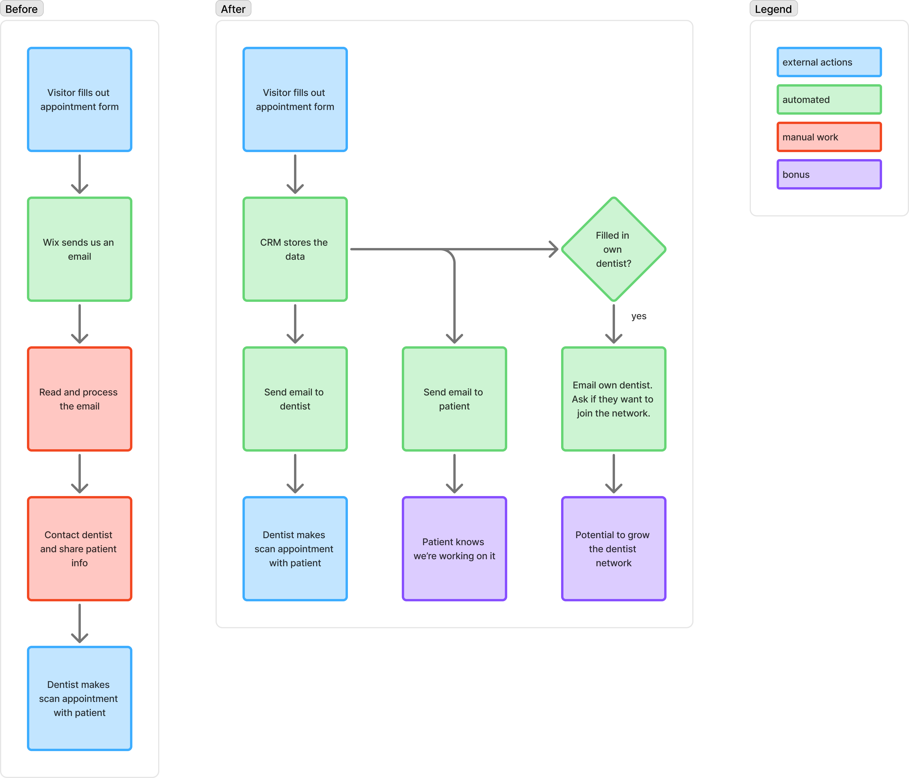

# Dentist appointment routing workflow

Clik.fit sells custom tailored mouthguards for athletes. The mouthguards are 3D designed
and 3D printed based on a 3D scan of the patient's teeth.

Clik has a publicly facing marketing website. This is where visitors can request a
dentist appointment with one of the partner dentists.

This marketing website is a simple Wix website. A platform like Wix makes it easy for
non-technical people to customize.

There is also an internal CRM, which is starting to become the source of truth of the
company.

## Challenge

Every time a visitor requests a dentist appointment, Wix sends Clik an email. Clik needs
to manually open and read the email, and send the visitor details to the right dentist.

The dentist then has to reach out to the customer to make the appointment.

There is a lot of manual work going on here, it is error prone, and doesn't scale well.

## Approach

Since there is a proper CRM setup already, we decided to use the power of a "real" web
app to automate this workflow.

Instead of letting Wix host the appointment form, we rebuilt it on a publicly accessible
page on the CRM. Now we can display it on the marketing website as an iframe.

All data collected by this form can now be stored in the main CRM database. All
selectable dental practices can be picked in the form, are now also sourced from the
database.

Every appointment request comes in as simple data, and we can kick off emails when this
happens.

## Solution overview

So the new workflow: Whenever a visitor enters their details, we kick off an email to
the dentist they picked. We also let the visitor know we've contacted the dentist. And
thirdly, the form asks who their own dentist is. This allows Clik to reach out and ask
if that dentist wants to join the dental network as well.

<figure class="rvo-diagram" markdown="span">
  
  <figcaption>
    The appointment hand-off, before and after. The red steps are the manual work
    that disappeared; the purple ones are upside the old flow had no room for.
    Click the diagram to open it full size.
  </figcaption>
</figure>

## Results & Impact

### Saving time

From spending a few minutes per appointment request to zero.

### Business growth

Every request sends out an email that has the potential to grow Clik's dental network. A
greater network leads to more sales in two ways:

1. Every dentist in the network can offer their patients a mouthguard from Clik.

2. Clik website visitors can choose more convenient scan locations as the network of
   dentists grows.

### Less waiting for the customer

Emails are sent instantly after a request comes in, allowing the customer to get help
faster.

### Higher accuracy

No manual processing of data, so less room for human mistakes.

## Tech stack

The marketing website runs on Wix. The main benefit of using a no code platform like
this is to allow non-technical people to manage it. Without having to roll your own CMS
systems.

The internal CRM is running Ruby on Rails. The database is PostgreSQL. Ruby on Rails
allows for a lot of functionality for very little effort.

Email sending is handled with AWS SES which has a high delivery rate and generous
default limits for transactional emails.
